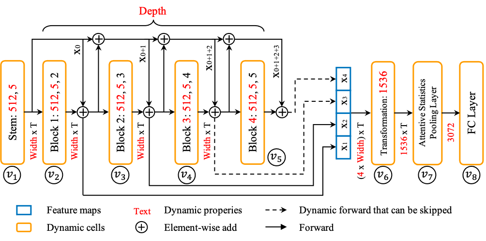

# Sugar

Efficient Speech Processing Tookit for Automatic Speaker Recognition

| **[HuggingFace](https://huggingface.co/mechanicalsea/efficient-tdnn)** |

The authors' PyTorch implementation and pretrained models of EfficientTDNN.

- 17 June 2022: EfficientTDNN are published in IEEE/ACM Transactions on Audio, Speech, and Language Processing.

## What's New



- EfficientTDNN: Efficient Architecture Search for Speaker Recognition [[arXiv]](https://arxiv.org/abs/2103.13581) [[IEEE/ACM TASLP]](https://ieeexplore.ieee.org/document/9798861)

## Models and Checkpoints

| Model | Training Dataset | Link |
|:---:|:---:|:---:|
| EfficientTDNN | VoxCeleb2 | HuggingFace: [mechanicalsea/efficient-tdnn](https://huggingface.co/mechanicalsea/efficient-tdnn) |

## Requirements and Installation

- PyTorch version >= 1.7.1
- Python version >= 3.7.9
- To install sugar:

```bash
git clone https://github.com/mechanicalsea/sugar.git
cd sugar
pip install --editable .
```

We provide pre-trained models for extracting speaker embeddings via [huggingface](https://huggingface.co/mechanicalsea/efficient-tdnn#compute-your-speaker-embeddings).

## Tutorials

- EfficientTDNN
  - [the evalution of a subnet](./tutorials/EfficientTDNN/EfficientTDNN.ipynb)
  - [evaluation of different subnets from a given supernet](./tutorials/EfficientTDNN/SubnetEvaluation.ipynb)
  - [search on the trained supernet](./tutorials/EfficientTDNN/TDNN-NAS.ipynb)

## EfficientTDNN Training Scripts

An example of training the TDNN supernet is given as follows.

```sh
task=''            # training stage, e.g., supernet, supernet_kernel, supernet_kernel_depth, ...
cycle_step=34120   # a half cycle of learning rate scheduler, e.g., GPU 1: 68248, GPU 2: 34120, GPU 4: 17056
second=48000       # largest stage: 32000, other stages: 48000
initial_weights='' # required to these stages except for the largest stage
logdir=''
python scripts/train_vox2_veri.py --distributed --augment \
      --task supernet_width1 --epochs 64 --cycle-step ${cycle_step} --second ${second} \
      --initial-weights ${initial_weights} \
      --logdir ${logdir}
```

## Load Pre-Trained Models for Inference

```python
import torch
from sugar.models import WrappedModel
wav_input_16khz = torch.randn(1,10000).cuda()

repo_id = "mechanicalsea/efficient-tdnn"
supernet_filename = "depth/depth.torchparams"
subnet_filename = "depth/depth.ecapa-tdnn.3.512.512.512.512.5.3.3.3.1536.bn.tar"
subnet, info = WrappedModel.from_pretrained(repo_id=repo_id, supernet_filename=supernet_filename, subnet_filename=subnet_filename)
subnet = subnet.cuda()
subnet = subnet.eval()

embedding = subnet(wav_input_16khz)
```

## Citing EfficientTDNN

Please, cite EfficientTDNN if you use it for your research or business.

```bibtex
@article{wr-efficienttdnn-2022,
  author={Wang, Rui and Wei, Zhihua and Duan, Haoran and Ji, Shouling and Long, Yang and Hong, Zhen},
  journal={IEEE/ACM Transactions on Audio, Speech, and Language Processing}, 
  title={EfficientTDNN: Efficient Architecture Search for Speaker Recognition}, 
  year={2022},
  volume={30},
  number={},
  pages={2267-2279},
  doi={10.1109/TASLP.2022.3182856}}
```

## Contact Information

For help or issues using EfficientTDNN models, please submit a GitHub issue.

For other communications related to EfficientTDNN, please contact Rui Wang (`rwang@tongji.edu.cn`).
